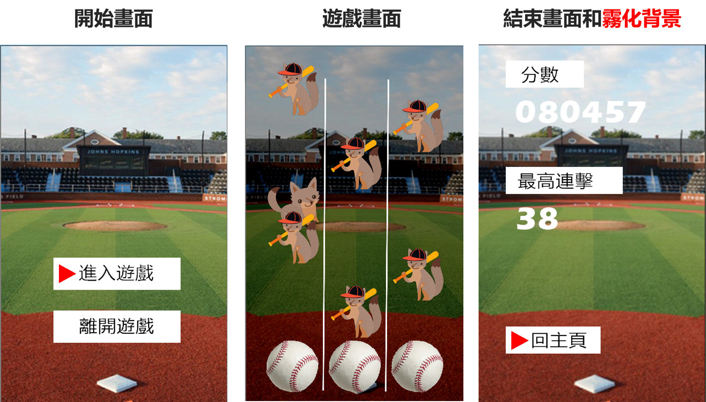
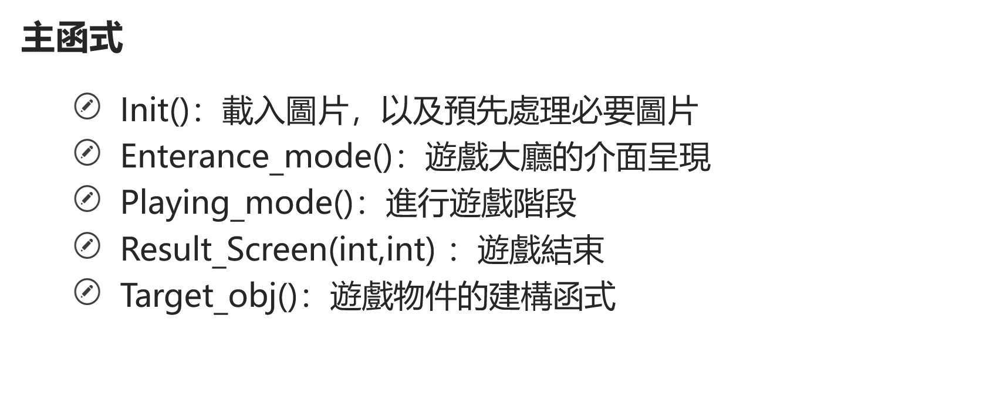
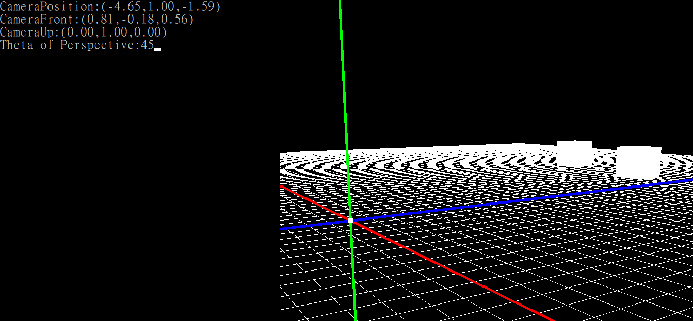

# 1052 電腦繪圖與影像處理 期中期末專案
## 期中專案
### 使用openCV製作反應力觸及遊戲研究該函式庫處理速度與適合性
* 遊戲畫面

* 速度比較

* 函式列表

* 注意./midterm/images 中圖片皆為網路截圖，非本人擁有
## 期末專案
### 使用openGL現代函式庫與舊型函式庫比較
* 操作方式
  - W:向前、A:向左、 S:向右、 D:向後
  - Page_Up:往上、 Page_Down:往下
  - 滑鼠左鍵拖曳:改變觀看角度
  - 滑鼠滾輪:放大縮小
  - R:放置全白正方體
* 執行畫面

* 製作流程

